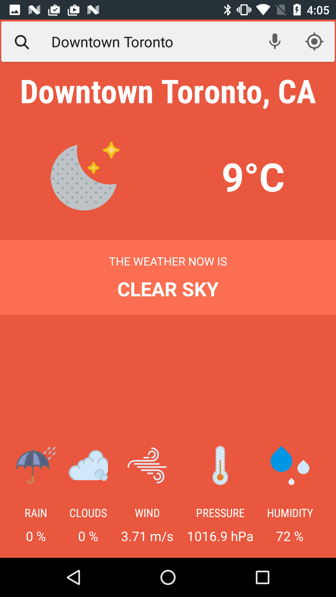
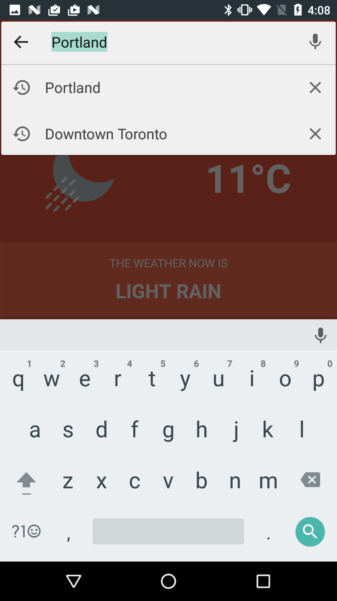
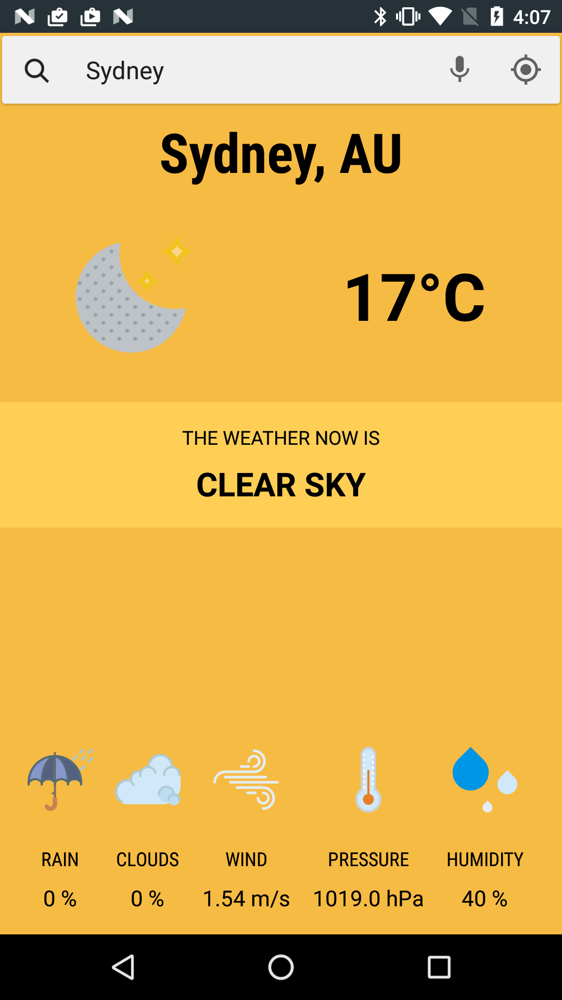

# Weather app

Just another weather app with MVP, RxJava and Realm.

## Architecture

The Model in this MVP implementation uses a repository pattern. 

Configuration changes are handled by storing the presenter in a Loader. Each fragment or activity that uses a Presenter has its own PresenterLoader created in the BaseFragment. Loaders survive configuration changes and the system manages their lifecycle so they'll be cleaned up automatically when the activity or fragment is permanently destroyed.
